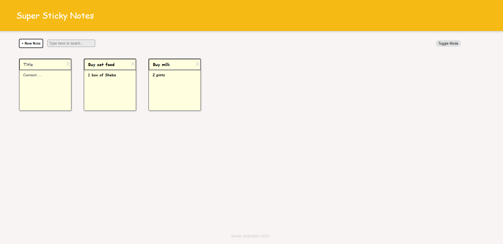

## Table of contents

- [Overview](#overview)
  - [The challenge](#the-challenge)
  - [Screenshot](#screenshot)
  - [Links](#links)
- [My process](#my-process)
  - [Built with](#built-with)
  - [What I learned](#what-i-learned)
  - [Continued development](#continued-development)
  - [Author](#author)

## Overview

SUPER STICKY NOTES 

I originally coded this app with class based components. It was one of the projects I did in my curriculum with my react.js class at Skillcrush.com. You can see the original code with class based components here! 

I decided that it would be a good thing to modernise the code for the app with functional components, useState and useEffect hooks. I also changed it slightly. I added a dark mode feature and some of the CSS and the color scheme is updated. I used CSS grid to make the list of notes responsive.

Please note that this notes app is best viewed on screen sizes above 350px and I also added a footer. The footer prevents the functionality of the notes added below it from working. In a real project this wouldn’t be the case. I added  a footer as it’s a portfolio project.

### The challenge

Users should be able to:

- The user should  be able to type the Title and Content fields of the note
- When user clicks the '+New Note' button the user should be able to add a new note whilst any previous notes are still saved in the notes app
- The user should be able to delete any notes by clicking the X
- The user should be able to search for any notes by typing its text in the search bar
- The user can toggle the dark mode on or off

### Screenshot

### Links

- Live Site URL: https://

## My process

Setting  up the App

I first set up the Footer and Header components with css styles.

The AddSearch component

I added another component called AddSearch in the components folder which is containing the ‘+ New Note’ button and the input for searching for a note.

The Note component

The last component I added in the components folder, the Note component, contains the basic jsx and styles that each note will have.

First of all the notes will be in an array so an array of notes is created. Since this array will change depending on how many notes we have we will need to use the useState hook. The notes array will be initialised to an empty array. Inside the return function in the App.js we add an ul container that will hold the notes from the notes array. We map through each note and render a Note component which contains an id and the content inside each note, i.e the title and its content. These will be destructured and passed as props to the Note component and added as the values. The onChange eventhandler will grab the typed input of the title and the content via e.target.value.

Then we have to tie the functionalities together for all of these components:

Add a note

The first functionality we will add will be adding a note . In App.js we will create the addNote function that will be passed to the ‘+ New Note’ button in AddSearch.js via the prop addNote. In this function we create a new note object that will be added to the notes array via setNotes. It will now hold an array of the new note added and all the previous notes if any, see:…prevNotes.

Edit a note 

We can edit a note we have saved with the function editNote that we define in App.js. This function will be passed as a prop, editNote, to the Note component and called in the onChange event handler of both the title or the content area.
The editNote function takes in the id of the note, a field and the text. It will be set into state via setNotes and thenmaps over all previous notes and checks if the id of note has the same id and if the field is equal to “title”. If so then it will return a new note with the new edited text. If field is not equal to “title”, i.e. it's equal to “content” then it will return the note with the new content text. Else if the id of the note is the same it will just return the note, i.e it’s not been edited.

Delete a note 

In App.js we add a function called deleteNote which will accept the id of the note to be deleted. Each note in our notes array has an id and when a new note gets added a new id for this note gets generated. Inside our deleteNote function we will use the filter function to remove the note that had the same id as the id that was passed in. We store the filtered (deleted notes) in a new array variable called updatedNotes. We set this in state via setNotes and then we pass it the updatedNotes.

We will pass this deleteNote function down the component tree to the Note component via the deleteNote prop. In the X, the delete button, we add the OnClick event handler and pass in an arrow function which takes in the id we get from the destructured props.

Searching for a note

In App.js we add a new state for searching for text where the initial value is set to an empty string. We then pass the setSearchText and searchText props to the AddSearch component. This is so we can get the value the user has typed via the e.target.value.

Now we have the value the user types in the search input but next we need to filter the notes to only show the notes that contain that text. In App.js we filter each note to see if the title includes what’s been typed in the search text for the title field or if the content field contains the search text.

Saving to local storage

We want to save and retrieve from local storage so that we still have the same notes/data when we close the app or refresh it. In App.js we add the useEffect hook. This effect will save our notes to local storage anytime the notes change.
We are saving the notes to local storage with the key ‘notes’ which we will use to retrieve the notes. We add the notes variable to the dependency array so that every time the notes array get updated with new notes it will trigger the function we have set in useEffect, so to save the new notes to local storage.

Then we want to retrieve any notes that are saved in local storage when the app loads. To retrieve the notes the App goes to local storage when it first loads and will retrieve the data that has the key ‘notes’. We will do this in the notes array. 

Dark mode

I added a dark mode toggle button to the right of the search bar. When we toggle it will turn dark mode on/off.

In App.js we use the useState hook, const [darkMode, setDarkMode] = useState(false) to indicate whether the app is currently in dark mode or not. The initial state should not be in dark mode so we set the initial state to false. 

We then  pass the setDarkMode function to the Search component via the prop handleToggleDarkMode. Then in Search.js we can destructure this prop and call it in the onClick property of the toggle button. In this function we set the state to the opposite of what the current dark mode value is. 

To apply the dark mode class from App.css we will need to create a new div in that wraps around the container div in App.js This allows us to add styles to the overall app i.e the dark mode without affecting any previous styles. In this wrapper div we will add a template string to determine if we want to add the dark-mode class or not based on the dark mode state variable, darkMode. The logic says that if darkMode is equal to true then add the dark-mode class.

### Built with

- React.js
- JavaScript
- CSS 
- Flexbox
- CSS Grid

### What I learned

I learned a lot from seeing how you could transform the original class based code into the more modern way of writing react. I hence feel more confident with using functional components and setting 'things' in state with the useState hook. It was also a good exercise to see how we can use the useEffect hook for saving data, 'the notes', to localStorage. I got a lot of practice of passing functions and props down and up the component tree which was really important. I see this as propbably one of the fundamentals you must need master to become comfortable with React.js.

### Continued development

I will continue to practice building apps and especially focus on mastering passing functions back up to the parent. That's the part I struggled most with and I intend on working on until I feel it's second nature!

## Author

- Website - https://www.annie-indreiten.com/
- Github – https://github.com/AnnieCat73
- LinkedIn - https://www.linkedin.com/in/annieindreitendeveloper/

### Deployment

This section has moved here: [https://facebook.github.io/create-react-app/docs/deployment](https://facebook.github.io/create-react-app/docs/deployment)

### `npm run build` fails to minify

This section has moved here: [https://facebook.github.io/create-react-app/docs/troubleshooting#npm-run-build-fails-to-minify](https://facebook.github.io/create-react-app/docs/troubleshooting#npm-run-build-fails-to-minify)
